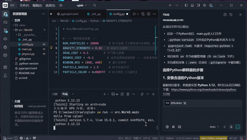

姓名：韦晓语
学号：202411081018
专业：计算机科学与技术（师范）

# Taichi万有引力N体仿真项目
> 基于 Taichi 语言实现 GPU 加速的 N 体问题数值模拟，实时可视化粒子在牛顿万有引力作用下的聚集、旋转等动力学行为。

## 环境配置

- Python 3.12
- 依赖库：`taichi`, `numpy`
- 包管理工具：`uv`

### 快速开始

```bash
# 安装 uv（若无）
pip install uv

# 创建虚拟环境并安装 taichi
uv venv
uv pip install taichi

# 运行仿真
uv run python -m src.work0.main

```
# 项目架构

本项目采用**src源码布局（Source Layout）**，贴合现代Python工程化标准，目录结构如下：

```plain
cglab/
├── .venv/               # 局部虚拟环境（uv工具管理，Git忽略上传）
├── src/
│   └── work0/
│       ├── __init__.py  # 包标识文件
│       ├── config.py    # 全局配置模块：常量、参数统一管控
│       ├── physics.py   # 核心计算模块：GPU并行引力计算、粒子更新
│       └── main.py      # 程序入口：初始化、主循环、可视化渲染
├── pyproject.toml           # 项目配置、依赖声明（uv）
├── uv.lock                  # 依赖版本锁文件
├── .python-version          # Python版本（示例：3.10）
├── .gitignore
└── README.md
```

***

# 代码逻辑

项目采用**配置层-计算层-渲染层**三层架构，核心代码逻辑拆解如下：

## 1. config.py — 全局配置层

作为项目的“参数控制台”，**统一归集所有可调节常量**，修改参数时无需侵入计算或渲染代码，提升调试效率。

```python
# 粒子仿真核心参数
NUM_PARTICLES = 800  # 仿真粒子总数
# 物理仿真参数
G = 0.5              # 万有引力常数
DT = 0.01            # 时间步长（控制仿真速度）
SOFTENING = 0.5      # 软化因子（避免粒子距离过近导致除零异常）
# 可视化窗口参数
WINDOW_WIDTH = 800   # 窗口宽度
WINDOW_HEIGHT = 600  # 窗口高度
```

## 2. physics.py — GPU计算层

依托Taichi框架实现**GPU并行加速**，负责万有引力物理计算与粒子状态更新。

```python
import taichi as ti
# 导入全局配置参数
from config import *

# 初始化Taichi后端，自动适配GPU/CPU，开启硬件加速
ti.init(arch=ti.gpu)

# 定义GPU显存数据场：存储粒子位置、速度（直接在显存读写，减少拷贝开销）
pos = ti.Vector.field(2, dtype=ti.f32, shape=NUM_PARTICLES)
vel = ti.Vector.field(2, dtype=ti.f32, shape=NUM_PARTICLES)

# GPU并行核函数：计算粒子间万有引力
@ti.kernel
def compute_force():
    # 外层for循环自动并行，多线程分配至GPU算力核心
    for i in range(NUM_PARTICLES):
        force = ti.Vector([0.0, 0.0])
        for j in range(NUM_PARTICLES):
            if i != j:
                # 计算粒子间距与引力矢量
                diff = pos[j] - pos[i]
                dist = diff.norm() + SOFTENING
                force += G * diff / (dist ** 3)
        # 根据合力更新粒子速度
        vel[i] += force * DT

# GPU并行核函数：更新粒子位置
@ti.kernel
def update_pos():
    for i in range(NUM_PARTICLES):
        pos[i] += vel[i] * DT
```

## 3. main.py — 入口渲染层（总控调度）

作为程序总控，负责粒子初始化、启动主循环、调度计算模块、完成可视化渲染。

```python
import taichi as ti
# 导入配置与计算模块
from config import *
from physics import *

# 初始化Taichi GUI可视化窗口
gui = ti.GUI("N-Body万有引力仿真", res=(WINDOW_WIDTH, WINDOW_HEIGHT))

# GPU并行初始化粒子：随机分布初始位置、零初始速度
@ti.kernel
def init_particles():
    for i in range(NUM_PARTICLES):
        pos[i] = ti.Vector([ti.random(), ti.random()]) * 0.8 + 0.1
        vel[i] = ti.Vector([0.0, 0.0])

# 执行粒子初始化
init_particles()

# 主循环：持续执行“计算-更新-渲染”流程
while gui.running:
    # 监听窗口交互事件（关闭、缩放等）
    gui.get_event()
    # 调用GPU计算模块：计算引力+更新位置
    compute_force()
    update_pos()
    # 渲染粒子：转为numpy数组绘制圆点
    gui.circles(pos.to_numpy(), color=0x00ff00, radius=2)
    gui.show()
```

***

# 功能实现（核心效果与工程价值）

## 演示GIF如下：

### 实时运动动图


## 1. 核心仿真功能

- **物理还原**：严格遵循牛顿万有引力定律，模拟多粒子间相互吸引、聚集、旋转等天体运动效果，还原N体问题物理规律。
- **GPU硬件加速**：借助Taichi的JIT编译与并行核函数，将海量计算任务调度至GPU执行，粒子可实现实时流畅仿真。
- **实时可视化**：弹出独立窗口渲染粒子动态，支持窗口交互，直观观测粒子群演化过程。

## 2. 工程化能力

- **环境可控**：uv虚拟环境+gitignore配置，保证依赖一致性，本地缓存、环境文件不上传Git，仓库轻量化。
- **可维护性强**：分层模块化设计，参数修改、逻辑拓展、bug调试互不干扰，适合后续新增力场、碰撞检测、色彩区分等功能。
- **规范运行**：支持标准Python模块运行指令，执行`uv run -m src.work0.main` 即可启动项目。