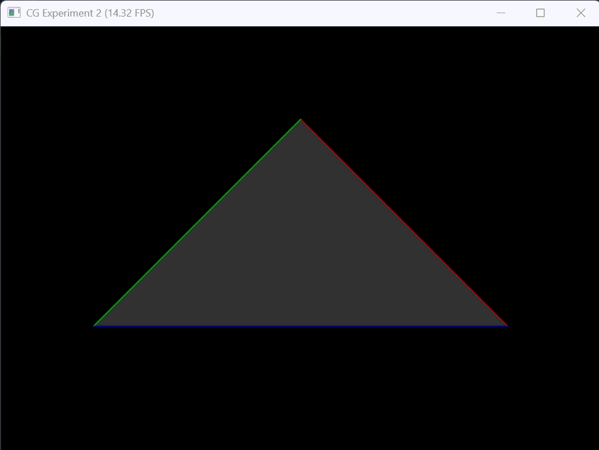
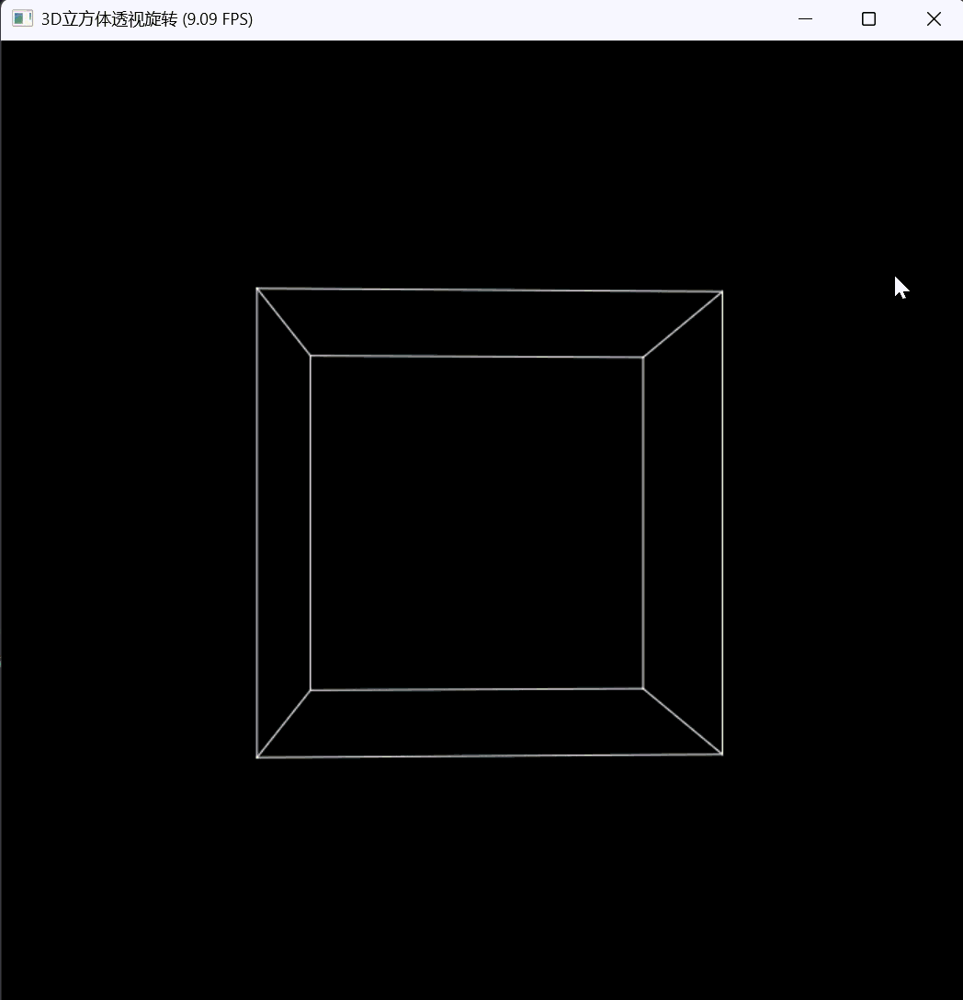

姓名：韦晓语
学号：202411081018
专业：计算机科学与技术（师范）


## 一、实验目标

1. 理解 3D 渲染完整 MVP（Model\-View\-Projection）坐标变换管线，理清世界空间、相机空间、NDC 标准化设备坐标、屏幕坐标的转换逻辑；

2. 独立手写实现**模型变换、视图变换、透视投影**4×4 齐次变换矩阵；

3. 熟悉 Taichi 语言基础语法、向量与 4 阶矩阵运算、GUI 窗口渲染流程。

## 二、项目目录架构

```Plain Text
src/work2/
├── main.py          # 主程序，完整MVP变换+三角形/立方体渲染逻辑
├── README.md        # 实验说明文档
└── outputs/         # 存放演示截图、动画GIF
    └── mvp_demo.gif
```

- `main.py`：包含矩阵生成函数、顶点变换管线、GUI 交互渲染、立方体拓展绘制逻辑；

- `outputs`：用于存放实验演示动图与结果截图。

## 三、环境依赖 \& 运行指令

### 依赖安装

```bash
uv pip install taichi numpy
```

### 启动程序

```bash
uv run python main.py
```

### 交互按键说明

- A：模型绕 Z 轴逆时针旋转

- D：模型绕 Z 轴顺时针旋转

- Esc：关闭 GUI 窗口、退出程序

## 四、代码整体逻辑

1. **顶点初始化**
基础实验预设三角形 3 个顶点：`(2,0,-2) / (0,2,-2) / (-2,0,-2)`；选做拓展定义立方体 8 顶点、12 条棱边，中心位于原点，边长 2。

2. **三大变换矩阵实现**

    - 模型矩阵`get_model_matrix`：接收角度，生成绕 Z 轴旋转的 4×4 齐次旋转矩阵；

    - 视图矩阵`get_view_matrix`：输入相机世界坐标，将整个场景平移使相机归位至原点；

    - 投影矩阵`get_projection_matrix`：分两步 —— 先透视挤压转正交空间、再正交映射，完成透视投影。

3. **完整 MVP 变换管线**
列向量右乘规则：`MVP = M_proj @ M_view @ M_model`；顶点乘 MVP 后做**透视除法**（xyz/w）得到 NDC 坐标，再映射至 700×700 屏幕像素。

4. **渲染与交互循环**
Taichi GUI 窗口实时刷新，根据按键修改旋转角度，遍历图元顶点连线框渲染；选做拓展替换为立方体线框绘制。

## 五、实现功能

### 基础必做功能

1. 完整手写 Model/View/Projection 三类 4×4 齐次变换矩阵；

2. 角度弧度自动转换、视锥体边界 t/b/l/r 自动推导；

3. 正确处理相机 \- Z 朝向、近远截面符号、透视除法；

4. 700×700 GUI 窗口渲染彩色线框三角形，AD 键控制旋转；

5. 严格遵循列向量右乘矩阵变换顺序，输出正确 2D 屏幕图形。

### 选做拓展功能

1. 构建中心在原点、边长为 2 的立方体（8 顶点 \+ 12 棱）；

2. 修改渲染管线绘制立方体线框，展示 3D 透视立体感；

3. 双姿态立方体旋转插值过渡动画。

### 实验演示

<div align="center">
  
</div>

<div align="center">
  
</div>

## 六、实验现象与结果分析

1. 基础三角形：按下 A/D 时图形匀速绕 Z 轴旋转，远处图形因透视投影自动缩小，体现近大远小透视效果；

2. 变换逻辑验证：

    - Model 矩阵：控制物体自身旋转，仅改变物体世界姿态；

    - View 矩阵：等价于 “相机反向移动”，整体平移全部场景；

    - Projection 矩阵：将 3D 视锥体压缩到 \[\-1,1\] 标准化设备立方体；

3. 选做立方体效果：立方体前后棱长度视觉不一致，可直观区分透视投影与正交投影差异；插值动画可观察平滑过渡的旋转形变过程。
