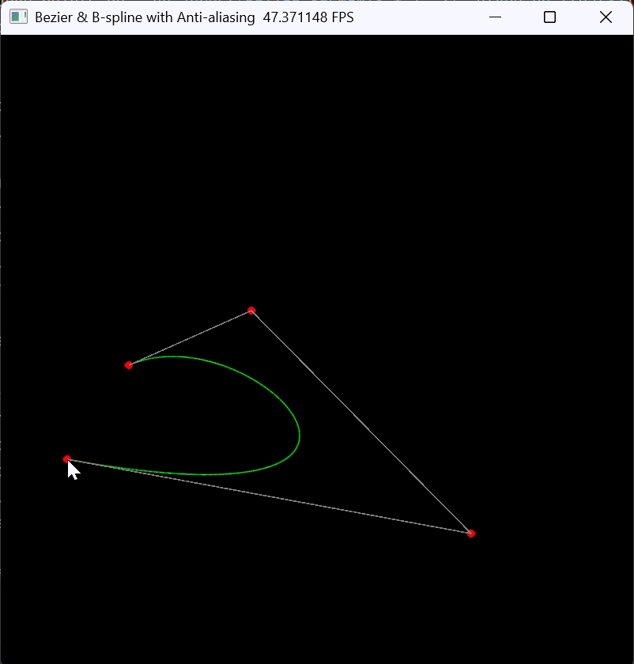

姓名：韦晓语
学号：202411081018
专业：计算机科学与技术（师范）

## 一、实验目标

1. 理解贝塞尔曲线的几何构造原理，掌握 De Casteljau 递归线性插值算法。

2. 掌握基础光栅化原理：在像素缓冲区中手动计算、映射并点亮像素。

3. 理解 CPU‑GPU 分离架构，掌握批量数据传输（Batching）与 GPU 并行渲染优化。

4. 实现鼠标、键盘交互，完成控制点添加、清空、曲线实时绘制。

5. （选做）实现曲线反走样、均匀三次 B 样条曲线，对比两种曲线的几何特性。

## 二、项目目录架构

```Plain Text
src/Work3/
├── main.py        # 主程序：De Casteljau算法、GPU光栅化、交互逻辑、选做拓展
├── README.md      # 实验说明文档
└── outputs/
    └── bezier_demo.gif  # 实验演示动图存放目录
```

- `main.py`：包含常量定义、GPU 显存预分配、De Casteljau 算法、GPU 绘制内核、GUI 交互主循环、控制点对象池管理；

- `outputs`：用于存放运行效果 GIF 与截图。

## 三、环境依赖 \& 运行指令

### 依赖安装

```bash
uv pip install taichi numpy
```

### 运行程序

```powershell
uv run python src/Work2_2/main.py
```

### 交互按键说明

- **鼠标左键**：添加控制点

- **C 键**：清空所有控制点，重置画布

- **B 键（选做）**：切换贝塞尔 / B 样条曲线模式

## 四、整体代码逻辑

1. **GPU 显存预分配**
初始化 Taichi GPU 后端，固定分配 3 个全局显存 Field：

    - `pixels`：800×800 屏幕像素缓冲区

    - `curve_points_field`：固定长度曲线点缓冲区，用于 CPU‑GPU 批量传输

    - `gui_points`：固定容量控制点对象池，避免动态内存申请

2. **De Casteljau 算法实现（CPU）**
纯 Python 递归 / 迭代实现多层线性插值：
对参数 $t\in[0,1]$，不断对相邻控制点做 $\boldsymbol{P}'=(1-t)\boldsymbol{P}_i + t\boldsymbol{P}_{i+1}$，逐层降维直到得到唯一曲线上点。

3. **GPU 光栅化绘制内核**
使用 `@ti.kernel` 编写 GPU 并行渲染函数：
将归一化浮点坐标映射为屏幕像素索引，做边界越界检查后点亮像素；
采用**批量传输**：CPU 一次性计算全部曲线点 → 传入 GPU → GPU 并行渲染，避免频繁跨设备通信造成卡顿。

4. **GUI 交互主循环**

    - 监听鼠标点击，添加控制点；
    监听键盘 C 清空控制点；
    控制点≥2 时，CPU 采样 1000 个曲线点，批量传入 GPU 并调用内核绘制；
    使用**固定大小对象池**渲染控制点：多余位置填充屏幕外坐标，保证 Field 长度固定。

5. **选做拓展逻辑**

    - 反走样：采样点周围 3×3 像素邻域，按距离做颜色权重混合，消除阶梯锯齿；

    - B 样条：采用均匀三次 B 样条基矩阵分段计算曲线，每 4 个控制点生成一段，实现局部控制特性，按键切换模式。

## 五、实现功能

### 基础必做功能

1. 基于 De Casteljau 算法，CPU 端计算任意阶贝塞尔曲线；

2. 严格遵循现代图形学管线：CPU 批量计算 → 一次性传入 GPU → GPU 并行光栅化；

3. 800×800 画布中绿色绘制贝塞尔曲线，灰色连线绘制控制多边形，红色圆点标记控制点；

4. 鼠标左键添加控制点、C 键一键清空画布；

5. 固定显存池管理，不动态申请内存，保证渲染性能稳定。

### 选做拓展功能

1. 亚像素级反走样光栅化，实现曲线边缘平滑无锯齿；

2. 实现均匀三次 B 样条曲线，支持贝塞尔 / B 样条一键切换；

3. 直观对比：贝塞尔全局形变、B 样条局部控制的几何差异。

### 实验演示

<div align="center">
  
</div>

## 六、实验现象与结果分析

1. 基础效果：每添加一个控制点，曲线实时更新，曲线始终**经过首尾控制点**，受中间控制点牵引；贝塞尔曲线具有**全局控制**特性，任意控制点修改会改变整条曲线。

2. 性能表现：采用 CPU‑GPU 批量传输后，渲染流畅无卡顿；若改为逐点通信会出现严重帧率下降，验证了现代图形管线 Batching 设计的必要性。

3. 光栅化现象：基础版本曲线存在明显阶梯锯齿；反走样后边缘平滑，验证亚像素混合的抗锯齿原理。

4. B 样条对比：修改局部控制点仅影响一小段曲线，体现**局部控制**优势；且不随控制点增多而提高多项式阶数，稳定性更强。

