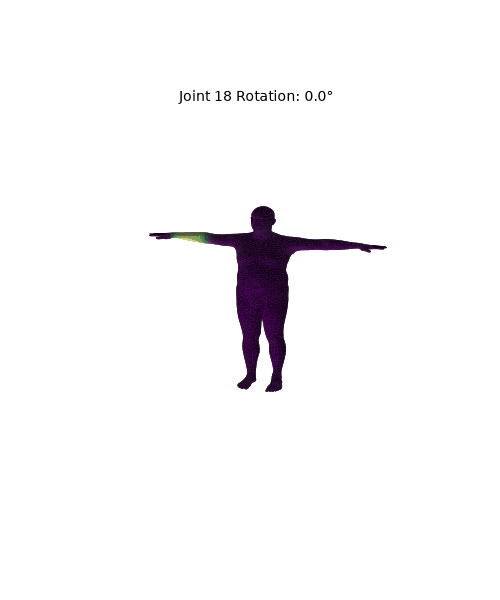

姓名：韦晓语
学号：202411081018
专业：计算机科学与技术（师范）


## 一、实验目标

理论理解：掌握参数化人体 SMPL 模型整体结构，理清模板网格、形状参数、姿态参数、关节回归器、蒙皮权重的相互关联。
数学流程：完整理解 LBS 线性混合蒙皮四大计算阶段，掌握每一阶段输入、输出与计算公式。
工程实践：加载官方 SMPL 模型，拆分提取 LBS 全部中间变量分阶段可视化；手动复现完整 LBS 计算流程，与官方前向传播结果做误差对比验证。

## 二、实验原理

### 2\.1 LBS 线性混合蒙皮四阶段完整流程

#### \(a\) 模板网格 $\bar{T}$ 与蒙皮权重 $\mathcal{W}$

初始输入为 T 型标准人体模板网格 $\bar{T}$，每个顶点预存储全部关节对应的蒙皮权重 $\mathcal{W}$，权重代表该顶点受对应骨骼的影响程度。
此时网格未经过体型、姿态修改；蒙皮权重决定后续顶点跟随骨骼运动的加权规则，最终顶点 4×4 变换矩阵由所有权重对关节变换加权求和得到。

#### \(b\) 形状校正网格 $\bar{T}+B_S(\beta)$ 与回归关节 $J(\beta)$

形状参数 $\beta$ 控制人体高矮、胖瘦、肩宽等体型特征，通过形状基 blend\_shapes 计算形状偏移量：
$T_{shape} = \bar{T} + B_S(\beta)$
代码实现：
$v_{shaped} = v_{template} + blend_shapes(\beta, shapedirs)$
基于形变后的网格，使用关节回归矩阵 J\_regressor 计算匹配当前体型的关节坐标：
$J(\beta) = \mathcal{J}(T_{shape})$
$J = vertices2joints(J_regressor, v_{shaped})$
关节位置随体型动态变化，并非固定常量。

#### \(c\) 姿态校正网格 $T_P(\beta,\theta)=\bar{T}+B_S(\beta)+B_P(\theta)$

人体关节弯曲时，仅骨骼刚体旋转会造成皮肤拉伸失真，因此引入姿态修正偏移 pose blend shape。

1. 将轴角姿态参数转为旋转矩阵 rot\_mats；

2. 构造姿态特征 $pose_feature = R(\theta)-I$；

3. 通过 posedirs 矩阵映射得到姿态偏移 pose\_offsets；

4. 叠加到形状网格得到姿态校正顶点：
$T_P(\beta,\theta) = \bar{T} + B_S(\beta) + B_P(\theta)$
核心代码逻辑：

```Plain Text
rot_mats = batch_rodrigues(...)
pose_feature = (rot_mats[:, 1:, :, :] - ident).view(...)
pose_offsets = torch.matmul(pose_feature, posedirs).view(...)
v_posed = pose_offsets + v_shaped
```

#### \(d\) LBS 线性混合蒙皮最终姿态

输入：体型适配关节$J(\beta)$、姿态校正顶点$T_P(\beta,\theta)$、顶点蒙皮权重$\mathcal{W}$
对每个顶点，将全部关节全局变换矩阵按权重加权融合，完成皮肤绑定：
$v_i' = \sum_{k=1}^{K} w_{ik} , G_k(\theta, J(\beta)) \begin{bmatrix} v_i^{posed} \\ 1 \end{bmatrix}$
$v_i^{posed}$：经过形状、姿态校正的顶点齐次坐标；
$w_{ik}$：顶点 i 对第 k 个关节的影响权重；
$G_k$：第 k 个关节运动学全局刚体变换矩阵。
对应代码流程：

```Plain Text
J_transformed, A = batch_rigid_transform(...)
W = lbs_weights.unsqueeze(...).expand(...)
T = torch.matmul(W, A.view(...)).view(..., 4, 4)
v_homo = torch.matmul(T, v_posed_homo.unsqueeze(-1))
verts = v_homo[:, :, :3, 0]
```

### 2\.2 五大核心区分变量

1. v\_template：原始模板网格顶点（标准 T pose，无体型、姿态形变）

2. v\_shaped：叠加形状偏移后的体型修正顶点

3. J：由体型网格回归得到的人体关节坐标

4. v\_posed：叠加姿态修正偏移后的顶点

5. verts：完整 LBS 蒙皮运算输出的最终人体网格顶点

## 三、项目目录架构

```Plain Text
src/Work8_SMPL_LBS/
├── main.py        # SMPL加载、分阶段可视化、手写LBS、误差对比主程序
├── README.md      # 实验报告文档
├── smpl_models/
│   └── SMPL_NEUTRAL.pkl
└── outputs/
    ├── stage_a_template_weights.png
    ├── all_joint_weights.png
    ├── stage_b_shaped_joints.png
    ├── stage_c_pose_offsets.png
    ├── stage_d_lbs_result.png
    ├── comparison_grid.png
    └── summary.txt
```

\[main\.py\]\(main\.py\)：SMPL 模型加载、参数配置、四大阶段中间量提取、网格可视化、手写完整 LBS 计算、与官方模型误差统计；
outputs：存储各阶段可视化图片、对比总图、误差记录文本；
smpl\_models：存放中性 SMPL 模型文件。

## 四、环境依赖与运行指令

### 依赖安装

```powershell
uv pip install torch torchvision smplx numpy matplotlib open3d
```

### 启动程序

```powershell
uv run python src/Work8_SMPL_LBS/main.py
```

### 程序输出说明

运行后自动生成全部阶段可视化图像，计算手写 LBS 与官方前向的平均、最大误差，写入 summary\.txt。

## 五、代码整体逻辑与实验任务实现

### 任务 1：加载 SMPL 模型并输出基础参数

1. 下载 SMPL\_NEUTRAL\.pkl 模型文件；

2. 使用 smplx\.create 加载模型，配置 model\_type='smpl'、gender='neutral'；

3. 读取并打印记录模型基础数据：顶点总数、面片总数、关节总数、形状参数 betas 维度。

### 任务 2：可视化模板网格与蒙皮权重（阶段 a）

1. 绘制原始 T\-pose 模板网格；

2. 单关节权重热力图：选取任意关节，将该关节对全部顶点的权重映射为网格颜色，权重越高颜色越深，输出 stage\_a\_template\_weights\.png；

3. 可选：全关节主导权重分布图，每个面片按权重最大关节分配颜色，输出 all\_joint\_weights\.png；
配套思考：

4. 单个顶点设置多关节权重的原因；

5. 顶点权重完全集中单一关节、权重平均分布两种情况的视觉缺陷。

### 任务 3：可视化形状校正与回归关节（阶段 b）

1. 输入非零形状参数 β，计算体型修正顶点 v\_shaped；

2. 通过关节回归矩阵从 v\_shaped 求解适配体型的关节坐标 J；

3. 同画面绘制形变后人体网格 \+ 内部关节点，输出 stage\_b\_shaped\_joints\.png；
配套思考：

4. 关节随体型动态回归而非固定的原因；

5. 胖瘦体型下肩、髋、膝关节位置变化规律；

6. v\_template 与 v\_shaped 的核心差异。

### 任务 4：可视化姿态修正偏移 pose\_offsets（阶段 c）

1. 设置非零姿态参数 θ（抬手、弯肘等）；

2. 轴角转旋转矩阵，计算 pose\_feature 与姿态偏移 pose\_offsets；

3. 叠加得到 v\_posed，将 pose\_offsets 数值大小映射为网格颜色可视化；

4. 输出 stage\_c\_pose\_offsets\.png；
配套思考：

5. LBS 前增加姿态修正项的作用；

6. 去除 pose\_offsets 后关节弯曲处的失真现象；

7. v\_shaped 与 v\_posed 本质区别。

### 任务 5：完整 LBS 蒙皮结果可视化（阶段 d）

1. 根据人体运动学链计算所有关节全局变换矩阵；

2. 使用蒙皮权重对关节变换矩阵加权融合；

3. 求解最终蒙皮顶点 verts；

4. 绘制完成姿态绑定的人体网格与关节，输出 stage\_d\_lbs\_result\.png；
配套思考：

5. 原始体型关节 J 与姿态变换后 J\_transformed 的区别；

6. 使用多关节加权混合而非仅取最大权重关节的原因。

### 任务 6：生成四阶段总对比图

将 a/b/c/d 四个阶段图像拼接为 2×2 或 1×4 总图，标注各阶段标题，输出 comparison\_grid\.png，直观对比四阶段网格变化。

### 任务 7：手写 LBS 与官方模型误差验证

1. 固定统一 betas、全局旋转、身体姿态参数；

2. 调用官方 SMPL 前向传播得到标准顶点；

3. 运行自行复现的完整 LBS 流程得到手写 verts；

4. 逐顶点计算误差：平均绝对误差 MAE、最大绝对误差 MaxAE；

5. 将模型基础信息、两项误差指标写入 summary\.txt 保存。

## 六、实现功能

### 基础必做功能

1. 完整加载中性 SMPL 人体模型，读取顶点、面片、关节、形状基、姿态基、回归矩阵、蒙皮权重；

2. 分阶段提取 LBS 全部中间变量，独立可视化模板网格、体型形变、姿态偏移、最终蒙皮人体；

3. 实现单关节权重热力图、体型网格 \+ 关节叠加绘制、姿态偏移着色、最终姿态人体渲染；

4. 拼接四阶段对比总图，清晰展示 LBS 完整计算流程；

5. 手动复现完整线性混合蒙皮数学计算；

6. 对比手写实现与官方模型输出，计算平均、最大顶点误差并保存记录。

### 选做拓展功能

姿态动画生成：固定形状参数，控制单个关节角度连续旋转，逐帧生成人体动画图片，导出 GIF/MP4，直观观察骨骼运动时权重区域平滑过渡效果。

## 七、实验现象与结果分析

1. 蒙皮权重可视化：靠近关节的区域权重数值高、颜色更深；四肢交界处顶点同时受多关节影响，权重分布均衡；若仅单一关节权重，关节弯曲会出现皮肤撕裂。

2. 形状校正效果：修改 β 参数后人体胖瘦、身高同步变化，关节随体型同步缩放偏移，固定关节会出现骨骼与人体错位。

3. 姿态偏移可视化：pose\_offsets 高值集中在手肘、膝盖、肩膀等弯曲部位，无姿态修正时弯曲区域会发生严重拉伸、穿插失真。

4. LBS 最终效果：多关节加权混合使人体关节弯曲处皮肤平滑过渡，无硬撕裂；仅取单一最大权重会出现棱角、皮肤断层。

5. 误差验证结果：手写 LBS 与官方模型顶点误差极小，平均误差接近 0，证明复现的数学流程完全符合 SMPL 官方 LBS 标准。

6. 拓展动画效果：骨骼连续旋转时，蒙皮权重平滑插值带动皮肤同步运动，关节过渡自然流畅。

<div align="center">
  
</div>

## 八、注意事项总结

1. 轴角转旋转矩阵、姿态特征计算、齐次坐标变换需严格遵循 SMPL 官方运算顺序，顺序颠倒会造成人体扭曲；

2. 蒙皮加权运算必须使用 4×4 齐次变换矩阵，不能直接对三维顶点加权；

3. 关节回归依赖形状形变后的顶点，不可使用原始模板顶点求解关节；

4. 姿态偏移仅为网格预修正，不能替代 LBS 骨骼加权绑定，二者缺一不可；

5. 误差计算需统一输入参数（betas、body\_pose、global\_orient），参数不一致会导致误差偏大。